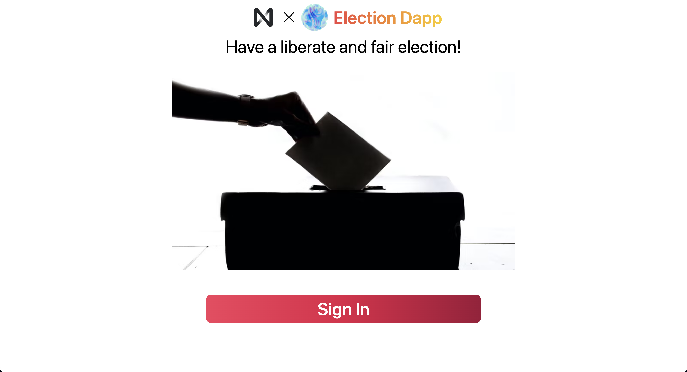

<p align="center">
  <br />
  
  <br/>
  <br />
  <p align="center">


</p>

<br/>

[](#table-of-contents)

<br/>

## • Overview

I made this project and text by myself. The text is located [this URL](https://app.unchain.tech/learn/ETH-dApp/). This is used in the engineer cmmunity `UNCHAIN`. 

This is dapp that you can run an election equaly using NEAR blockchain. You can distribute voting ticket and those who have it can vote once. If you are deployer, you can open and close the election whenever you want.

## • Links

[Deployed here](https://near-election.netlify.app)

`*Open in Google Chrome so that images can be seen correctly`

[](https://near-election.netlify.app)

## • Launch

1. run `yarn install` in terminal.

2. make your own NEAR wallet [here](https://wallet.testnet.near.org/)

3. install near-cli and login by implementing command below.

```
near login
```

4. run command below and deploy the contract.

```
yarn contract build
yarn contract deploy
```

5. run command below and start frontend

```
yarn client start
```